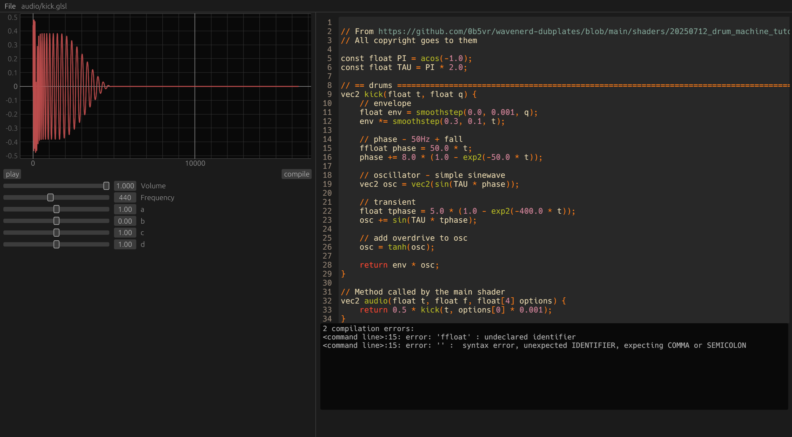

# Synth


A simple glsl audio editor.

- In-app code editor
- audio preview
- Open/save .glsl files
- shader compilation with error log



## Building & running

You will need to have the [Vulkan SDK](https://vulkan.lunarg.com) installed.
  
Then build and run `synth`:
```
git clone https://github.com/n-e-l/synth.git
cd synth
cargo run --release
```

## Planned features

- ~~Proper GPU based plot rendering~~
- Render both left and right audio channel
- Quick-compile keybind
- Longer audio sample generation